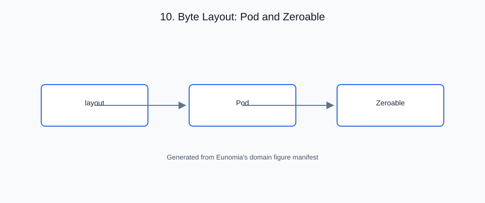

# 10. Byte Layout: Pod and Zeroable

<!-- generated-figure-start -->

*Figure 10.1 — Byte Layout: Pod and Zeroable*
<!-- generated-figure-end -->

## Governing equations

Reinterpreting a value as raw bytes is safe only when the type's layout
permits it. Two facts must hold:

1. **Zeroable** — the all-zero bit pattern is a valid, inhabited value
   (this excludes types with a validity niche at zero, such as `NonZeroU32`
   or `&T`).
2. **Pod** (plain-old-data) — every bit pattern of `size_of::<Self>()`
   bytes is a valid `Self`, and the type carries no padding or invalid
   representations.

These layout facts are the datatype-law statement of *which representations
are safe to reinterpret as bytes* — the contract GPU device buffers, FFI
boundaries, and serialization all rely on.

## The crate's abstraction

Eunomia owns the native `Zeroable`/`Pod` vocabulary rather than borrowing it
from `bytemuck`:

```rust,ignore
pub unsafe trait Zeroable: Sized {
    fn zeroed() -> Self { /* SAFETY: Self: Zeroable */ }
}

pub unsafe trait Pod: Sized {
    // any bit pattern of size_of::<Self>() bytes is a valid Self
}
```

- **`unsafe` marker traits.** The compiler cannot verify the layout facts
  they assert; every impl carries a `// SAFETY:` justification, and the
  scalar wrappers' `const _` size/alignment assertions pin the layout the
  impls rely on.
- **`bytemuck` bridge.** The `bytemuck` feature bridges these to
  `bytemuck::{Pod, Zeroable}` for GPU/FFI boundaries that fix that contract.
- **Whole-vocabulary coverage.** `F16`/`Bf16`/`F32`/`F64`/`F4`/`F8`/`Bf4`/
  `Bf8`/`I8`/`I16`/`I32` and `Complex<T>` (when `T` is) are `Pod`/`Zeroable`
  — every value is a valid byte string.

## Outline of this chapter

- Why layout facts gate byte reinterpretation
- `Zeroable` and the zero-niche exclusion
- `Pod`: no padding, no invalid bit patterns
- The `// SAFETY:` discipline and the `const _` layout pins
- The `bytemuck` bridge for GPU/FFI boundaries
