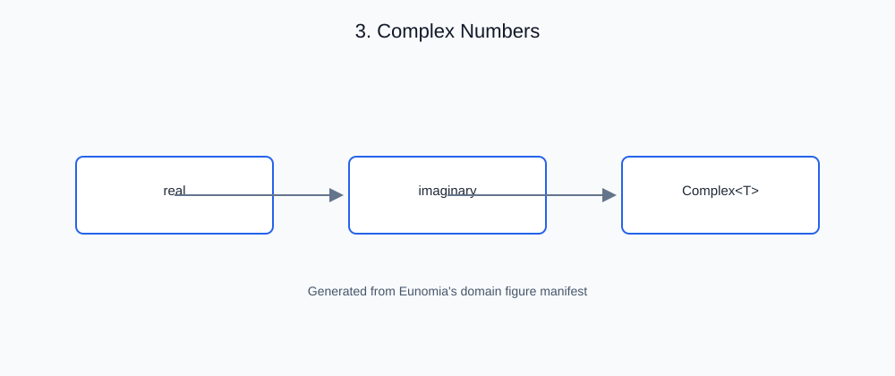

# 3. Complex Numbers

<!-- generated-figure-start -->

*Figure 3.1 — Complex Numbers*
<!-- generated-figure-end -->

## Governing equations

A complex number is the pair

$$z = \text{re} + \text{im}\cdot i,$$

with arithmetic defined field-wise for `Add`/`Sub`/`Neg` and by the complex
product and quotient for `Mul`/`Div`:

$$(a + bi)(c + di) = (ac - bd) + (ad + bc)i.$$

Complex values appear throughout Atlas where real arithmetic is insufficient
— phasors in acoustics, spectra in optics, and the eigen/signal surfaces in
linear algebra.

## The crate's abstraction

`Complex<T>` is the SSOT vocabulary type for `re + im·i`, replacing the
third-party `num_complex::Complex` across the stack:

```rust,ignore
#[repr(C)]
pub struct Complex<T> {
    pub re: T,
    pub im: T,
}

pub type Complex32 = Complex<f32>;
pub type Complex64 = Complex<f64>;
```

- **Layout-compatible.** `#[repr(C)]` `{ re, im }` with `bytemuck::Pod`/
  `Zeroable` when `T` is, so values round-trip through GPU device buffers and
  FFI boundaries identically to `num_complex::Complex`.
- **Field-wise semantics.** The imaginary component is *quadrature*, not a
  second physical unit — the `UnitScalar` seam (§7) scales complex values
  componentwise by a real coefficient.
- **Floating-point surface.** The complex module carries the arithmetic
  (`ops`), constants (`consts`), the float surface (`float`), and reduction
  helpers (`reduce`).

## Outline of this chapter

- Complex field arithmetic: `Add`/`Sub`/`Neg`/`Mul`/`Div`
- `#[repr(C)]` layout and the FFI/GPU round-trip guarantee
- `Complex32`/`Complex64` aliases and interop with the numeric stack
- The quadrature rule: one observable unit, no imaginary SI unit
- Worked example in [Complex Arithmetic in a Solver](examples/complex_arithmetic.md)
