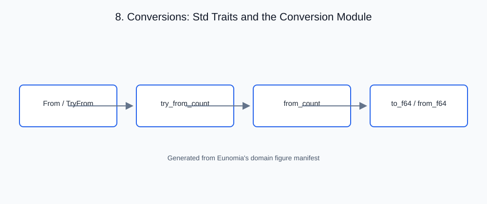

# 8. Conversions: Std Traits and the Conversion Module

<!-- generated-figure-start -->

*Figure 8.1 — Conversions: Std Traits and the Conversion Module*
<!-- generated-figure-end -->

## Governing equations

Converting a value from one numeric representation to another has one of
four contracts. It is **exact** when every source value is representable in
the target, **rounded** when the target is coarser (to nearest, ties to even,
with error at most half an ulp of the target), **checked** when some source
values have no target value and the conversion must report the failure, and a
**reinterpretation** when the same bits are read under another type. Rust's
`as` operator silently picks one of these per type pair, truncating,
wrapping, saturating or rounding, so a call site that uses it states none of
them. Eunomia therefore converts only through operations whose names and
documentation state the contract.

## The crate's abstraction

Each conversion takes the strongest form available:

| Contract | Form |
| --- | --- |
| exact integer widening | `From` / `.into()` |
| checked integer narrowing | `TryFrom`, failure handled |
| same-width sign reinterpretation | `cast_signed()` / `cast_unsigned()` |
| count into any element, exact or refused | `TryFromCount::try_from_count` → `Result<T, CountRangeError>` |
| count or signed integer into a float, rounded | `FloatElement::from_count`, `FloatElement::from_integer` |
| element out to `f64` | `NumericElement::to_f64` |
| `f64` into a float element, rounded | `FloatElement::from_f64` |
| float into integer, saturating, NaN to 0 | `IntegerTarget::from_rounded` (ties to even), `from_floor`, `from_truncated` |
| reduced float formats from `f32` bits | the native kernel `convert::{narrow, widen}` (§9) |

```rust,ignore
use eunomia::{FloatElement, NumericElement, TryFromCount, F16, I8};

let len = 300_usize;
assert_eq!(F16::from_count(len).to_f64(), 300.0); // exact below 2^11
assert!(I8::try_from_count(len).is_err());        // 300 does not fit i8
assert_eq!(i32::try_from_count(len), Ok(300));
assert_eq!(F16::from_integer(-5).to_f64(), -5.0);
```

- **The contract is in the name.** A reader can predict the result from the
  call: `from_count` rounds, `try_from_count` either converts exactly or
  returns a typed error, and `From` never loses information.
- **One home for casts std cannot express.** The integer-to-float roundings
  (`usize` and `i64` into `f32`/`f64`) live in `convert::count`, and the
  float-to-integer saturations live in `convert::integer`. These are the
  crate's only conversion `as` expressions, each module under one documented
  lint expectation.
- **No pair-generic cast.** Eunomia once shipped `CastFrom<T>`, a generic
  `as` between any two primitives. It was retired by
  [ADR 0007](../adr/0007-retire-castfrom.md), whose table maps each old form
  to its replacement. A conversion with no entry there enters `convert/` as a
  named method that states how it rounds and how it fails.

## Outline of this chapter

- The four conversion contracts: exact, rounded, checked, reinterpreted
- Why `as` hides the contract, and where the remaining casts live
- Counts and signed integers into elements: `try_from_count`, `from_count`,
  `from_integer`
- The `to_f64` / `from_f64` boundary between element precisions
- Floats into integers: `from_rounded`, `from_floor`, and saturation
- Adding a conversion: a named method in `convert/` with its contract
