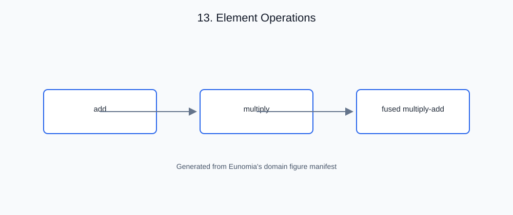

# 13. Element Operations

<!-- generated-figure-start -->

*Figure 13.1 — Element Operations*
<!-- generated-figure-end -->

## Governing equations

Element operations are the pointwise arithmetic of the scalar vocabulary —
the `Add`/`Sub`/`Mul`/`Div` operators kernels use for each element. Reduced
binary formats also implement `Rem` and all compound-assignment operators.
Their integer kernel computes exactly, then rounds once to the destination
format using nearest, ties-to-even. IEEE formats produce infinities on
overflow and preserve NaNs; finite-only formats saturate overflow and
nonzero division-by-zero results to signed maximum finite, while invalid
operations produce NaN. The rounding mode matches Berkeley SoftFloat §6.1
([rounding modes](https://www.jhauser.us/arithmetic/SoftFloat-3/doc/SoftFloat.html)).
`Rem` uses Rust's truncating-quotient remainder, whose sign matches the
dividend; this differs from IEEE `remainder`
([Rust Reference](https://doc.rust-lang.org/reference/expressions/operator-expr.html#arithmetic-and-logical-binary-operators)).
The f32/f64 wrappers use primitive arithmetic; integer wrappers retain their
two's-complement contract, and complex values use the field operations of §3.

## The crate's abstraction

The `ops` module provides the operation impls across the vocabulary:

- `ops::floats` — arithmetic for the float wrappers (`F16`/`Bf16`/`F32`/
  `F64` and the sub-byte formats), with float-semantic ordering.
- `ops::ints` — arithmetic for `I8`/`I16`/`I32`, with exact wrap semantics.

Together with the operator supertraits on `NumericElement` (§4), this gives
generic kernels a complete, uniform arithmetic surface:

```rust,ignore
fn l2_norm_sq<T: NumericElement>(x: T, y: T) -> T {
    x * x + y * y   // Add, Mul, and AddAssign are assumed by the trait
}
```

## Outline of this chapter

- The element arithmetic surface: `Add`/`Sub`/`Mul`/`Div`/`Assign`
- Float operations and their rounding rules
- Integer wrap arithmetic and why it is exact
- Complex field operations
- Building kernels over the operator supertraits of `NumericElement`
