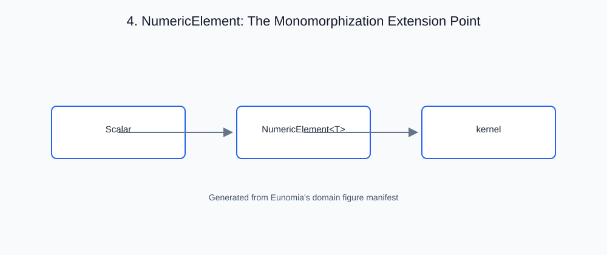

# 4. NumericElement: The Monomorphization Extension Point

<!-- generated-figure-start -->

*Figure 4.1 — NumericElement: The Monomorphization Extension Point*
<!-- generated-figure-end -->

## Governing idea

Atlas kernels are written once and instantiated across every shipped scalar
precision. `NumericElement` is the trait that makes that possible: it is the
**monomorphization extension point** for operations across all numeric
precisions. A kernel generic over `T: NumericElement` compiles once per
concrete `T` — zero-cost generics, no dynamic dispatch, no scalar-type suffix
in identifiers.

## The crate's abstraction

```rust,ignore
pub trait NumericElement:
    Sealed
    + Copy + Default + Send + Sync + 'static
    + PartialOrd + PartialEq + Debug
    + Add<Output = Self> + AddAssign
    + Sub<Output = Self> + SubAssign
    + Mul<Output = Self> + MulAssign
    + Div<Output = Self>
{
    const ZERO: Self;
    const ONE: Self;
    const NAN: Self;
    const INFINITY: Self;
    const BYTE_WIDTH: usize;
    const ALL_ONES: Self;
    // ... sign-bit mask, min/max, saturation, etc.
}
```

- **Closed set.** The trait is `Sealed`, so the implementor set is exactly
  the shipped scalar types — every operation is exhaustively known at
  compile time.
- **Constants over methods.** `ZERO`/`ONE`/`NAN`/`INFINITY` are associated
  constants, so generic kernels get identities without allocating.
- **Contract-named source constructors.** A count enters any element
  through `TryFromCount::try_from_count`, which converts exactly or returns a
  typed `CountRangeError`; `from_f64`, `from_count` and `from_integer` live on
  `FloatElement`, each documenting how it rounds (chapter 8).

## Outline of this chapter

- Why a sealed element trait, not a scalar-type-suffixed function family
- The associated constants: identities, sentinels, byte width, masks
- Operator supertraits: what a generic kernel may assume
- `TryFromCount` and the integer boundary
- Writing a kernel once over `NumericElement` and instantiating across
  `F32`/`F64`/`F16`/`Bf16`/`I32`/`Complex32`

## Minimum and maximum special values

`NumericElement::min_scalar` and `max_scalar` are value operations, not raw
`PartialOrd` expressions. For every shipped real floating-point scalar they
use the same table:

| Inputs | `min_scalar` | `max_scalar` |
| --- | --- | --- |
| one NaN and one non-NaN | the non-NaN value | the non-NaN value |
| two NaNs | NaN | NaN |
| `-0` and `+0` | `-0` | `+0` |
| all other values | numeric minimum | numeric maximum |

The NaN rule is commutative even though `PartialOrd` correctly reports every
NaN comparison as unordered. The signed-zero rule is also independent of
operand order. Primitive `f32`/`f64` implementations use their native
operations; wrapper types inherit the single trait default, so reductions and
`RealField::clamp` do not diverge by storage format. Integer sentinels named
`NAN` are ordinary zero values and follow integer comparison semantics.
