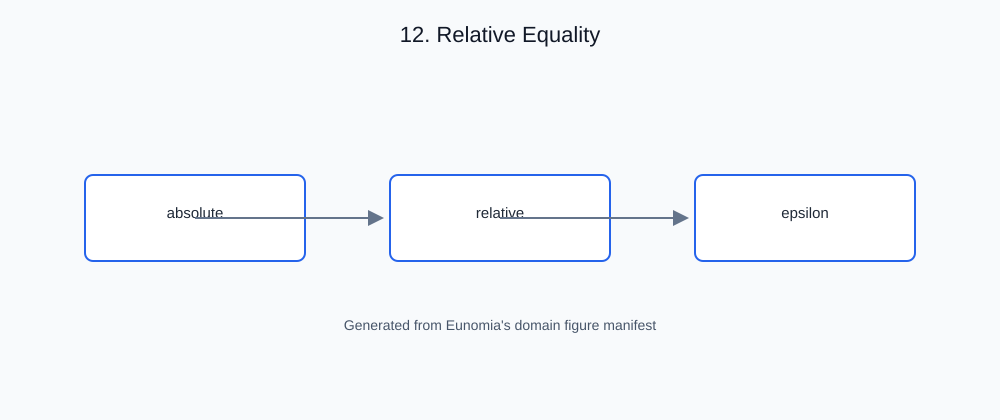

# 12. Relative Equality

<!-- generated-figure-start -->

*Figure 12.1 — Relative Equality*
<!-- generated-figure-end -->

## Governing equations

Two floating-point values are rarely *exactly* equal after arithmetic — the
rounding error of each operation accumulates. The standard test is a blended
absolute/relative tolerance: pass if the values are within an absolute
`epsilon`, **or** within a relative tolerance scaled to the magnitude of the
values:

$$|a - b| \le \varepsilon \quad \text{or} \quad |a - b| \le \text{rel}\cdot\max(|a|, |b|).$$

The `or` semantics are deliberate: the absolute clause covers values near
zero, where a relative comparison would collapse to nothing.

## The crate's abstraction

`relative_eq` mirrors the common `approx::assert_relative_eq!` API while
remaining `no_std`-friendly:

```rust,ignore
use eunomia::assert_relative_eq;

let a: F32 = ...;
let b: F32 = ...;
assert_relative_eq!(a, b);
```

- **The `RelativeEq` trait.** `RelativeEq::relative_eq(&self, other,
  epsilon, max_relative)` implements the blended test; `default_epsilon()`
  and `default_max_relative()` supply defaults when the caller specifies
  neither.
- **OR semantics matching `approx`.** A value passes if it is within
  `epsilon` **or** within `max_relative * scale` — the `approx` contract.
- **Implemented for the float vocabulary** (with blanket reference impls so
  `assert_relative_eq!(x, &y)` also works).

## Outline of this chapter

- Why exact equality fails after arithmetic
- The blended absolute/relative test and its OR semantics
- `RelativeEq` and the default tolerances
- Using `assert_relative_eq!` in tests and kernels
- When relative equality is the wrong tool (integers, bit-exact paths)
