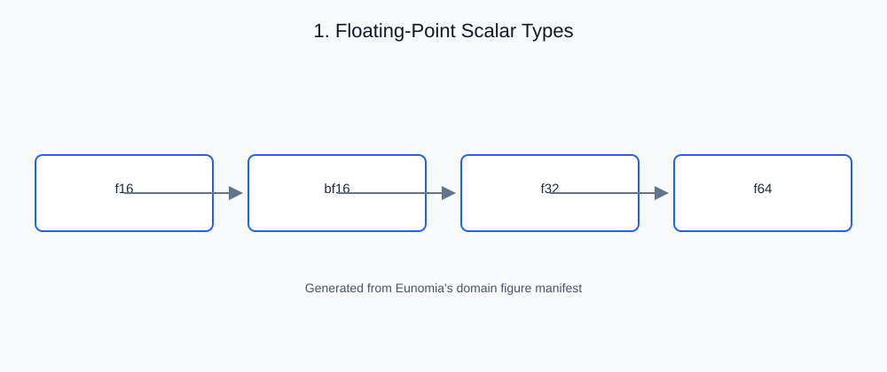

# 1. Floating-Point Scalar Types

<!-- generated-figure-start -->

*Figure 1.1 — Floating-Point Scalar Types*
<!-- generated-figure-end -->

## Governing equations

A floating-point number is a finite approximation to a real value, stored as

$$x = (-1)^{s} \cdot m \cdot 2^{e}$$

with a sign bit `s`, a significand `m` of width `M` bits (plus the implicit
leading bit in normal numbers), and an exponent `e` biased by a format-
specific constant `B` over `E` bits. The set of representable values is
determined entirely by the triple `(E, M, B)`:

| Format | `E` | `M` | Bias | Storage |
| --- | --- | --- | --- | --- |
| `F32` | 8 | 23 | 127 | `u32` |
| `F64` | 11 | 52 | 1023 | `u64` |
| `F16` (binary16) | 5 | 10 | 15 | `u16` |
| `Bf16` (bfloat16, E8M7) | 8 | 7 | 127 | `u16` |
| `F8` (E4M3) | 4 | 3 | 7 | `u8` |
| `F4` (E3M0) | 3 | 0 | 3 | `u8` |
| `Bf8` (E5M2) | 5 | 2 | 15 | `u8` |
| `Bf4` (E2M1) | 2 | 1 | 1 | `u8` |

## Rounding and the machine epsilon

Moving a real value into a format with `M` mantissa bits introduces a relative
error bounded by half an ulp. Eunomia's conversion kernel (§9) implements
round-to-nearest, ties-to-even, so the rounding error is the *smallest*
achievable for each format. `RealField::EPSILON` exposes the machine epsilon
(2⁻ᴹ, `f64::EPSILON` for `F64`, the correct half-precision value for `F16`).

## The crate's abstraction

Every format is a `#[repr(transparent)]` wrapper over its raw bit storage:

```rust,ignore
pub struct F16(pub u16);
pub struct F32(pub f32);
pub struct F64(pub f64);
pub struct Bf16(pub u16);
```

- **Float-semantic comparisons.** `PartialEq`/`PartialOrd` for `F16`/`Bf16`
  compare through `f32`, not bitwise, so `1.0` and `0x3C00` compare equal.
- **Exact layout.** `const _` assertions pin each type's size and alignment,
  and every type is `bytemuck::Pod`/`Zeroable` (§10).
- **Precision-correct construction.** `FloatElement::from_f64` (on `F16`/
  `Bf16`) rounds through the native kernel rather than a truncating `as` cast.

## Outline of this chapter

- IEEE-754 field anatomy and why `(E, M, B)` fully determines the format
- The reduced-precision formats: half, bfloat, and the sub-byte E4M3/E5M2/
  E3M0/E2M1 families — their dynamic range and precision trade-offs
- Round-to-nearest-ties-to-even and the role of `EPSILON`
- The wrapper-type contract: transparent storage, float-semantic equality,
  `Pod`/`Zeroable`, and the native conversion path
- Choosing a precision — worked example in
  [Choosing a Precision](examples/choosing_precision.md)
